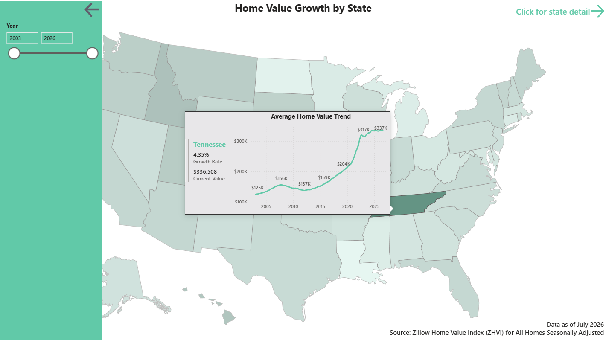

# Troy Brown — Power BI & Business Intelligence Portfolio

[](https://www.linkedin.com/in/troy-m-brown)
[](https://github.com/zero1191)
[](mailto:troybrownzero@gmail.com)

---

## 👋 About Me

I'm a Business Intelligence professional with 11+ years at Publix Super Markets, specializing in business intelligence, data visualization, and analytics consulting. Promoted to **Marketing Business Analytics Senior Consultant** in January 2026, I lead advanced analytics and BI initiatives for the Marketing Analytics team — architecting Power BI dashboards, building Alteryx automation workflows, and leveraging Databricks SQL to access and analyze enterprise data that drives marketing decisions.

My work sits at the intersection of **analytics engineering, data storytelling, and strategic consulting** — bridging the gap between technical data infrastructure and business leadership.

**Core stack:** Power BI · Alteryx · Databricks · SQL · Excel · Power Automate · Power Apps

---

## 🛠️ Skills & Technologies

| Category | Tools & Technologies |
|---|---|
| **Visualization** | Power BI (DAX, Power Query, Report Server) |
| **Data Engineering** | Alteryx Designer & Server, Databricks, Apache Spark |
| **Databases & Query** | SQL Server, Spark SQL, Data Modeling, ETL Design |
| **Cloud** | Microsoft Azure (AZ-900 Certified) |
| **Analytics** | Marketing Analytics, Financial Analytics, KPI Development |
| **Collaboration** | Stakeholder Consulting, Cross-functional Teams, Mentoring |

<br>

```
Power BI Desktop     ████████████████████  Expert
Alteryx              ██████████████████░░  Advanced
DAX                  ██████████████████░░  Advanced
Power Query (M)      ████████████████░░░░  Proficient
SQL                  ████████████████░░░░  Proficient
Excel / Power Pivot  ████████████████████  Expert
Power Automate       ██████████████████░░  Advanced
Power Apps           ████████████████░░░░  Proficient
Python (pandas)      ██████████░░░░░░░░░░  Familiar
Azure Data Services  ██████████░░░░░░░░░░  Familiar
```

---

<!-- ============================================================
     FEATURED REPORTS
     ============================================================ -->

## ⭐ Featured Reports

> Click any **Live Report** link to open the interactive Power BI dashboard.

| # | Project | Category | Live Report |
|---|---|---|---|
| 1 | US Home Values | Real Estate | [View Report](https://app.powerbi.com/view?r=eyJrIjoiYTU4YzIyMzAtZDQ0MS00ZTY5LWI0M2UtY2ZiOWZlOTllNGU0IiwidCI6ImY3ZmVmZWQ2LWYzNzktNDU3OS1iM2YwLWE0ZWZiZTFhN2RkZiJ9) |
| 2 | <!-- TODO: Project name --> | <!-- TODO: e.g. Finance --> | [View Report](<!-- TODO: Paste Publish to Web URL -->) |
| 3 | US Home Values | Real Estate | [View Report](https://app.powerbi.com/view?r=eyJrIjoiYTU4YzIyMzAtZDQ0MS00ZTY5LWI0M2UtY2ZiOWZlOTllNGU0IiwidCI6ImY3ZmVmZWQ2LWYzNzktNDU3OS1iM2YwLWE0ZWZiZTFhN2RkZiJ9) |
| 4 | <!-- TODO: Project name --> | <!-- TODO: e.g. HR Analytics --> | [View Report](<!-- TODO: Paste Publish to Web URL -->) |

---

<!-- ============================================================
     PROJECT 1
     ============================================================ -->

## 🏡 Project 3 — US Home Values

**Category:** Real Estate Trends  
**Data Source:** Zillow Home Value Index (ZHVI) for All Homes Seasonally Adjusted  
**Tools Used:** Power BI Desktop · DAX · Power Query · Power BI Service

### Overview

This report provides a unified view of long‑term real estate trends across every U.S. state, with the ability to drill down into counties, cities, and even ZIP codes. It solves a core business problem by transforming fragmented housing data into clear insights on appreciation, volatility, and compound annual growth rates, helping leaders evaluate market performance and identify emerging opportunities. The primary audience of this report could include real estate analysts, investment teams, or strategy leaders who need fast, data‑driven visibility into how home values evolve over time and where growth is accelerating or slowing.

### Key Features

- Rules based dynamic drillthrough button and field parameters to switch between county, city, and zip code detail.
- Collapsible filter pane and info panes utilizing bookmarks and boomark navigation.
- Custom report page for tooltips with timeseries data and CAGR calculation.
- Shape map visual with color gradient for growth rate by state.
- Time intelligence measures for calculating YoY growth rates.

### Screenshot

<!-- TODO: Replace the src with your actual screenshot path.
           Place images in an /assets/images/ folder in your repo. -->


*Figure 1: Homepage of the report showing collapsible filter pane, custom tooltip, and dynamic drillthrough button*

### 🔗 Interactive Report

<!-- TODO: Replace the iframe src with your Power BI Publish to Web embed URL.
           Get it from: Power BI Service → File → Embed Report → Publish to Web.
           Remove the HTML comment tags to activate the embed. -->

<iframe
  title="Us Home Values"
  width="100%"
  height="541.25"
  src="https://app.powerbi.com/view?r=eyJrIjoiYTU4YzIyMzAtZDQ0MS00ZTY5LWI0M2UtY2ZiOWZlOTllNGU0IiwidCI6ImY3ZmVmZWQ2LWYzNzktNDU3OS1iM2YwLWE0ZWZiZTFhN2RkZiJ9"
  frameborder="0"
  allowFullScreen="true">
</iframe>

> 🔗 **[Open full interactive report in new tab](https://app.powerbi.com/view?r=eyJrIjoiYTU4YzIyMzAtZDQ0MS00ZTY5LWI0M2UtY2ZiOWZlOTllNGU0IiwidCI6ImY3ZmVmZWQ2LWYzNzktNDU3OS1iM2YwLWE0ZWZiZTFhN2RkZiJ9)**

---

<!-- ============================================================
     PROJECT 3
     ============================================================ -->

## 🏡 Project 3 — US Home Values

**Category:** Real Estate Trends  
**Data Source:** Zillow Home Value Index (ZHVI) for All Homes Seasonally Adjusted 
**Tools Used:** Power BI Desktop · DAX · Power Query · Power BI Service

### Overview

This report provides a unified view of long‑term real estate trends across every U.S. state, with the ability to drill down into counties, cities, and even ZIP codes. It solves a core business problem by transforming fragmented housing data into clear insights on appreciation, volatility, and compound annual growth rates, helping leaders evaluate market performance and identify emerging opportunities. The primary audience of this report could include real estate analysts, investment teams, or strategy leaders who need fast, data‑driven visibility into how home values evolve over time and where growth is accelerating or slowing.

### Key Features

- Rules based dynamic drillthrough button and field parameters to switch between county, city, and zip code detail.
- Collapsible filter pane and info panes utilizing bookmarks and boomark navigation.
- Custom report page for tooltips with timeseries data and CAGR calculation.
- Shape map visual with color gradient for growth rate by state.
- Time intelligence measures for calculating YoY growth rates.

### Screenshot

<!-- TODO: Replace the src with your actual screenshot path.
           Place images in an /assets/images/ folder in your repo. -->


*Figure 1: Homepage of the report showing collapsible filter pane, custom tooltip, and dynamic drillthrough button*

### 🔗 Interactive Report

<!-- TODO: Replace the iframe src with your Power BI Publish to Web embed URL.
           Get it from: Power BI Service → File → Embed Report → Publish to Web.
           Remove the HTML comment tags to activate the embed. -->

<iframe
  title="Us Home Values"
  width="100%"
  height="541.25"
  src="https://app.powerbi.com/view?r=eyJrIjoiYTU4YzIyMzAtZDQ0MS00ZTY5LWI0M2UtY2ZiOWZlOTllNGU0IiwidCI6ImY3ZmVmZWQ2LWYzNzktNDU3OS1iM2YwLWE0ZWZiZTFhN2RkZiJ9"
  frameborder="0"
  allowFullScreen="true">
</iframe>

> 🔗 **[Open full interactive report in new tab](https://app.powerbi.com/view?r=eyJrIjoiYTU4YzIyMzAtZDQ0MS00ZTY5LWI0M2UtY2ZiOWZlOTllNGU0IiwidCI6ImY3ZmVmZWQ2LWYzNzktNDU3OS1iM2YwLWE0ZWZiZTFhN2RkZiJ9)**

---

## 🎯 Target Roles

I'm exploring senior BI developer and analytics consulting opportunities focused on:

- Enterprise Power BI reporting strategy and governance
- Scalable self-service analytics platforms for business users
- Data-informed decision-making at the leadership level
- Analytics team mentorship and BI best-practice champions

**Open to:** BI Developer · Analytics Consultant · Senior BI Analyst · Analytics Engineering · BI Lead

---

## 📜 Certifications

| Certification | Issuer | Issued |
|---|---|---|
| Microsoft Certified: Azure Fundamentals (AZ-900) | Microsoft | August 2026 |

---
*Last updated: September 2026*
